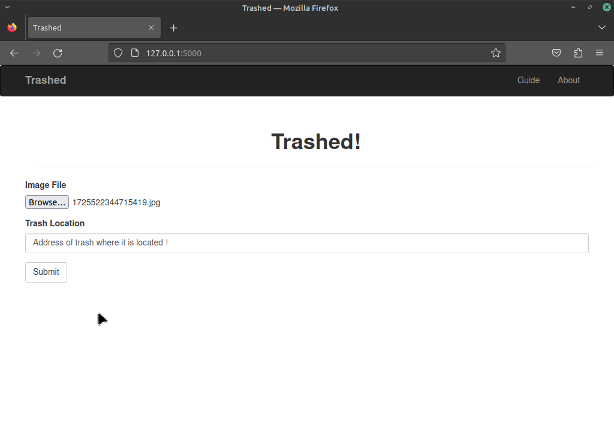

### TRASHED

- Upload trash images on flask web interface to prompt authorities
- CNN detects trash images with 95.3% accuracy
- SQLite database for fast and minimal database implementation

#### Note
- Some files were purposefully removed to protect from plagiarism
- Mail akshit.ck@gmail.com if you are interested in knowing more about this project

Web interface screenshot:

